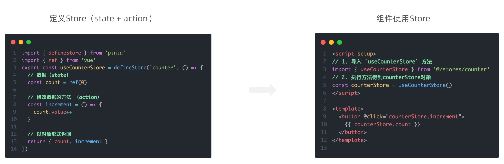
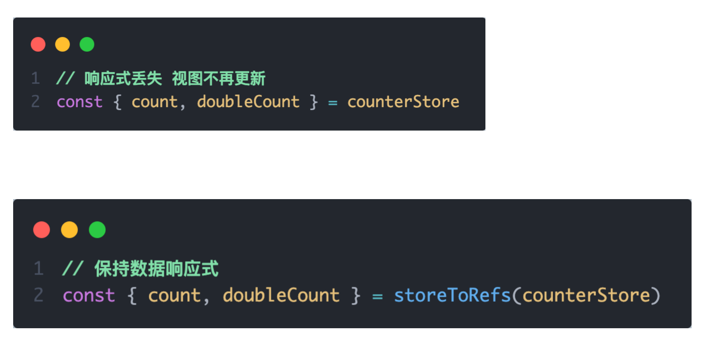

# Vue3 状态管理 - Pinia

## 1. 什么是Pinia

Pinia 是 Vue 的专属的最新状态管理库 ，是 Vuex 状态管理工具的替代品


## 2. 手动添加Pinia到Vue项目

后面在实际开发项目的时候，Pinia可以在项目创建时自动添加，现在我们初次学习，从零开始：

1.  使用 Vite 创建一个空的 Vue3项目

```bash
npm init vite@latest
```

2.  按照官方文档安装 pinia 到项目中 


## 3. Pinia基础使用

1. 定义store
2. 组件使用store




## 4. getters实现

Pinia中的 getters 直接使用 computed函数 进行模拟, 组件中需要使用需要把 getters return出去


## 5. action异步实现

方式：异步action函数的写法和组件中获取异步数据的写法完全一致

- 接口地址：http://geek.itheima.net/v1_0/channels

- 请求方式：get

- 请求参数：无


需求：在Pinia中获取频道列表数据并把数据渲染App组件的模板中


## 6. storeToRefs工具函数

使用storeToRefs函数可以辅助保持数据（state + getter）的响应式解构



## 7. Pinia的调试

Vue官方的 dev-tools 调试工具 对 Pinia直接支持，可以直接进行调试


## 8. Pinia持久化插件

官方文档：https://prazdevs.github.io/pinia-plugin-persistedstate/zh/

1. 安装插件 pinia-plugin-persistedstate

```jsx
npm i pinia-plugin-persistedstate
```

2. 使用 main.js

```jsx
import persist from 'pinia-plugin-persistedstate'
...
app.use(createPinia().use(persist))
```

3. 配置 store/counter.js

```jsx
import { defineStore } from 'pinia'
import { computed, ref } from 'vue'

export const useCounterStore = defineStore('counter', () => {
  ...
  return {
    count,
    doubleCount,
    increment
  }
}, {
  persist: true
})
```

4. 其他配置，看官网文档即可

 
